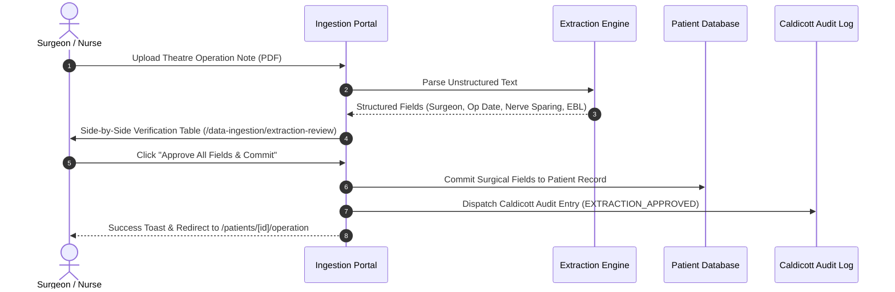
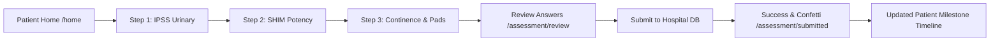

# UK RALP Surgical Outcomes Database v2
## Client Specification, Module Breakdown & End-to-End Flow Guide

---

## 1. Executive Product Overview & Clinical Mission

The **UK RALP Surgical Outcomes Database v2** is an enterprise-grade clinical registry and patient-reported outcome measures (PROMs) platform tailored specifically for **Robotic-Assisted Laparoscopic Prostatectomy (RALP)** in the UK National Health Service (NHS) and private healthcare sectors.

### Primary Clinical Objectives:
1. **Longitudinal Oncological Tracking**: Tracking PSA nadir, biochemical recurrence (BCR threshold: $\text{PSA} \ge 0.2\text{ ng/mL}$), and secondary salvage therapies over a 36-month timeline.
2. **Standardized Functional Recovery Measurement**: Capturing validated patient-reported outcomes (IPSS for urinary bother, SHIM/IIEF-5 for erectile potency, and standardized pad-count continence tracking).
3. **Surgical Quality & Benchmarking**: Evaluating surgeon-specific and unit-wide **Trifecta** (Continence + Potency + Cancer Control) and **Pentafecta** (+ Negative Margins + No Complications) metrics against British Association of Urological Surgeons (BAUS) and National Prostate Cancer Audit (NPCA) standards.
4. **Intelligent Document Ingestion**: Reducing clinical administrative burden by converting unstructured theatre notes and histology PDFs into structured, verified database entries.
5. **Caldicott Principle 7 & GDPR Governance**: Enforcing immutable audit trails, role-based access control, and automated pseudonymization for research and registry exports.

---

## 2. Platform Architecture & User Roles

```mermaid
graph TD
    A[Global Root Portal] --> B[Clinician Command Center]
    A --> C[Patient Recovery Portal]
    A --> D[Standalone Admin Console]

    subgraph "Clinician Portal (/dashboard, /patients, /data-ingestion, /follow-ups, /analytics)"
        B --> B1[Dashboard & Triage Hub]
        B --> B2[Master Patient Registry]
        B --> B3[4-Tab Surgical Dossier]
        B --> B4[Intelligent Document Ingestion]
        B --> B5[Outcomes & Pentafecta Analytics]
    end

    subgraph "Patient Recovery Portal (/home, /assessment/*)"
        C --> C1[Patient Recovery Hub]
        C --> C2[Step 1: IPSS Questionnaire]
        C --> C3[Step 2: SHIM Potency Questionnaire]
        C --> C4[Step 3: Continence & Pads Assessment]
        C --> C5[Review, Consent & Submit]
    end

    subgraph "Admin & Governance Console (/admin/*)"
        D --> D1[Admin Command Center]
        D --> D2[Role-Based User Management]
        D --> D3[Caldicott Principle 7 Audit Trail]
        D --> D4[NPCA Data Quality Hub]
        D --> D5[Pseudonymized Registry Exports]
    end
```



### User Roles & Permission Matrix:
| Role | Access Level | Key Capabilities | Audit Identity |
| :--- | :--- | :--- | :--- |
| **Consultant Urological Surgeon** | Full Clinical | Register patients, record surgery, approve AI extractions, review PROMs, view unit benchmarks. | GMC Number + Full Name |
| **Uro-Oncology Clinical Nurse** | Clinical Review | Update follow-up visits, trigger PROM reminders, review urinary/sexual rehabilitation notes. | Nursing PIN + Full Name |
| **Clinical Data Officer** | Ingestion & Audit | Ingest documents, resolve extraction conflicts, monitor NPCA data completeness metrics. | Hospital Staff ID |
| **System Administrator** | Governance | User provisioning, Caldicott audit inspections, pseudonymized national registry exports. | Admin ID |
| **RALP Patient** | Personal Portal | Complete digital PROMs (IPSS/SHIM/Continence), view personal milestone follow-up schedule. | Patient NHS / Hospital ID |

---

## 3. Module-by-Module & Page-by-Page Breakdown

### MODULE 1: Clinician Command Center & Surgical Registry

#### 1.1 Clinician Dashboard (`/dashboard`)
- **Purpose**: Real-time morning command center for the clinical team.
- **Key Features**:
  - **4 Top-Level KPIs**: Total RALP Cohort count, 30-Day Overdue Reviews, Unreviewed Ingestion Jobs, and 12-Month Trifecta Rate.
  - **Overdue & Due Follow-up Priority Queue**: Flags patients requiring immediate PSA checks or PROM reviews with direct links to patient files.
  - **Surgeon Caseload Distribution**: Visual caseload breakdown across operating surgeons (e.g., VK, RDM, CI, OAK).
  - **Quick Action Bar**: One-click shortcuts to Register Patient, Upload Operation Note, and View Analytics.

#### 1.2 Master Patients Registry (`/patients`)
- **Purpose**: Searchable, filterable directory of all registered prostatectomy patients.
- **Key Features**:
  - **Instant Debounced Search**: Sub-millisecond filtering by Patient Name, NHS Number, or Hospital Number.
  - **Clinical Filters**: Filter by Primary Surgeon, Clinical Stage (cT1c to cT3b), Gleason Grade Group (1 to 5), and Ingestion Completeness Score (0-100%).
  - **Data Completeness Indicators**: Color-coded badges indicating missing Demographics, Baseline, Operation Note, or Histology.

#### 1.3 Comprehensive 4-Tab Patient Record (`/patients/[id]`)
- **Purpose**: The definitive clinical single-source-of-truth for an individual RALP patient.
  - **Tab 1: Pre-Op Cancer Baseline (`/patients/[id]`)**:
    - Pre-operative PSA (ng/mL) and PSA date.
    - Diagnostic Biopsy Gleason Score (e.g., $3+4=7$, Grade Group 2).
    - Biopsy Positive Cores Percentage (Worst core % vs Best core %).
    - Cambridge Prognostic Group (CPG) & D'Amico Risk Classification.
  - **Tab 2: Theatre Operation Note (`/patients/[id]/operation`)**:
    - Primary Operating Surgeon & Surgical Date.
    - Bladder Neck Preservation status (`Full sparing`, `Reconstructed`, `Standard`).
    - Nerve-Sparing Details: Bilateral vs Unilateral, with independent Left and Right 5-point nerve preservation grades (5/5 = Full Fascial Preservation).
    - Sphincter Preservation Grade & Anterior/Posterior Reconstruction status.
    - Estimated Blood Loss (mL) & Operative Duration (mins).
  - **Tab 3: Post-Operative Histopathology (`/patients/[id]/histology`)**:
    - Pathological Stage (pT2a, pT2c, pT3a with EPE, pT3b with Seminal Vesicle Invasion).
    - Pathological Gleason Score & Grade Group migration (checking for upgrading/downgrading from biopsy).
    - Surgical Margin Status: $R0$ (Negative, clear margin) vs $R1$ (Positive margin with length in mm and anatomical location).
  - **Tab 4: Longitudinal Follow-up Schedule (`/patients/[id]/follow-up`)**:
    - 7-milestone follow-up timeline (6-week catheter check, 2-month, 6-month, 12-month, 18-month, 24-month, 36-month).
    - Longitudinal PSA Tracker with automated Biochemical Recurrence detection ($\text{PSA} \ge 0.2\text{ ng/mL}$).
    - Integrated PROM score cards for each milestone.

#### 1.4 Register New RALP Patient (`/patients/new`)
- **Purpose**: Clinical onboarding wizard for new elective prostatectomy patients.
- **Key Features**: NHS Number formatting, auto-calculation of patient age from DOB, baseline risk scoring, and automatic generation of the longitudinal follow-up schedule.

---

### MODULE 2: Intelligent Document Ingestion & AI Verification



#### 2.1 Document Ingestion Hub (`/data-ingestion`)
- **Purpose**: Central staging area for incoming scanned operation sheets, clinic letters, and histology pathology reports.
- **Key Features**: Document upload dropzone, status filtering (`Pending Review`, `Approved`, `Conflict Detected`), and OCR confidence score meters.

#### 2.2 Extraction Review & Verification Table (`/data-ingestion/extraction-review`)
- **Purpose**: Side-by-side clinician verification preventing unvalidated AI data from polluting the database.
- **Key Features**:
  - Compares Extracted Text vs. Existing Registry Data.
  - Confidence scoring with badge indicators (High >90%, Medium, Low).
  - Source toggle switch (`Extract` vs `Database` vs `Manual Override`).
  - **One-Click Approval**: Automatically writes to the patient record, writes a Caldicott Principle 7 audit log entry, and navigates directly to the updated patient operation record with a toast.

#### 2.3 Clinical Conflict Resolution Hub (`/data-ingestion/conflicts`)
- **Purpose**: Structured clinical adjudication when two documents report conflicting surgical parameters (e.g., Blood loss recorded as 200ml on Anaesthetic chart vs 250ml on Surgeon Operation Note).
- **Key Features**: Side-by-side reconciliation cards, mandatory clinical rationale input, and permanent audit logging of the chosen source of truth.

---

### MODULE 3: Patient Recovery & Digital PROM Assessment Portal



#### 3.1 Patient Recovery Home (`/home`)
- **Purpose**: Calming, patient-centric portal for post-operative recovery tracking.
- **Key Features**: Clean, non-intimidating visual style, clear recovery milestone progress bar, and single-click "Start Assessment" prompt when a follow-up questionnaire is due.

#### 3.2 Step 1: IPSS Urinary Symptoms (`/assessment/ipss`)
- **Purpose**: International Prostate Symptom Score tracking lower urinary tract symptoms (LUTS).
- **Questions**: 7 symptom questions (Incomplete emptying, frequency, intermittency, urgency, weak stream, straining, nocturia) scored 0-5 + 1 Quality of Life (QoL) Bother score (0 = Delighted, 6 = Terrible).
- **Classification**: Mild (0-7), Moderate (8-19), Severe (20-35).

#### 3.3 Step 2: SHIM Potency Assessment (`/assessment/shim`)
- **Purpose**: Sexual Health Inventory for Men (IIEF-5) assessing erectile function recovery following nerve-sparing surgery.
- **Questions**: 5 questions covering erection confidence, firmness for penetration, maintenance capability, and overall satisfaction.
- **Classification**: Severe ED (1-7), Moderate ED (8-11), Mild-Moderate (12-16), Mild (17-21), No ED (22-25).

#### 3.4 Step 3: Continence & Pad Usage (`/assessment/incontinence`)
- **Purpose**: Standardized continence assessment.
- **Metrics**: Daytime status (Completely dry, security liner/1 pad, 2 pads, $\ge 3$ pads), night-time pad usage (0 pads = dry overnight), and pad size categorization.

#### 3.5 Step 4 & 5: Review, Submit & Milestone Completion (`/assessment/review` & `/assessment/submitted`)
- **Purpose**: Patient confirms answers before clinical transmission.
- **Outcome**: Atomic database update saving scores directly into `patient.proms`, automatically marking the matching follow-up milestone as `Completed`, and dispatching an audit entry to the Caldicott log.

---

### MODULE 4: Follow-up Pathways & Surgical Outcomes Analytics

#### 4.1 Longitudinal Follow-ups Center (`/follow-ups`)
- **Purpose**: Registry-wide surveillance queue across all 7 post-op milestones (6w, 2m, 6m, 12m, 18m, 24m, 36m).
- **Key Features**: Tabbed queues (`All`, `Due (Next 30 Days)`, `Overdue`, `Completed`), inline PSA recording, and PROM status tracking.

#### 4.2 Surgeon Outcomes & Benchmarking Analytics (`/analytics`)
- **Purpose**: Objective surgical quality evaluation benchmarked against NPCA national averages.
- **Key Charts & Metrics**:
  - **Trifecta Rate (%)**: Cancer control ($\text{PSA} < 0.2$) + Continence (0-1 pad) + Potency ($\text{SHIM} \ge 17$) at 12 months.
  - **Pentafecta Rate (%)**: Trifecta + Negative Surgical Margins ($R0$) + No Clavien-Dindo III-V complications.
  - **Margin Rates by Pathological Stage**: Positive surgical margin ($R1$) rates benchmarked for pT2 organ-confined disease (Target: $<10\%$) and pT3 extraprostatic disease.
  - **Functional Recovery Trajectories**: 36-month longitudinal curves showing recovery velocity for urinary continence and erectile potency.

#### 4.3 Clinical Reports Hub (`/reports`)
- **Purpose**: One-click generation of statutory audit reports.
- **Available Reports**: National Prostate Cancer Audit (NPCA) Data Return, BAUS Surgical Quality Report, and Hospital Multidisciplinary Team (MDT) Summary.

---

### MODULE 5: Standalone Executive Admin & Governance Console

#### 5.1 Admin Command Center (`/admin`)
- **Purpose**: Governance overview for Medical Directors and Information Governance Leads.
- **Key Metrics**: System security health, Caldicott audit event count, active clinician logins, and data quality compliance scores.

#### 5.2 User Management & Permissions (`/admin/users`)
- **Purpose**: Role-based access control (RBAC) management.
- **Key Features**: Provisioning of Consultant Surgeons, Clinical Nurse Specialists, Data Officers, and Patients, with mandatory GMC Number recording for clinical accountability.

#### 5.3 Caldicott Principle 7 Audit Trail (`/admin/audit-log`)
- **Purpose**: Immutable chronological audit log satisfying UK Caldicott Principle 7: *"The duty to share information can be as important as the duty to protect patient confidentiality."*
- **Logged Events**: Every patient creation, baseline update, operation note commit, histology entry, extraction approval, PROM submission, and registry export.

#### 5.4 NPCA / BAUS Data Quality Hub (`/admin/data-quality`)
- **Purpose**: Identifying and rectifying missing clinical registry fields prior to annual national submissions.
- **Analysis**: Per-field completeness scoring across Demographics, Baseline Cancer Data, Theatre Operation Data, Histology, and 12M PROMs.

#### 5.5 Pseudonymized Registry Data Exports (`/admin/exports`)
- **Purpose**: Secure export engine for national reporting and research.
- **Security Features**: Automated pseudonymization hashing patient NHS numbers and Hospital Numbers into irreversible alphanumeric tokens (`PSEUDO-HASH-XXXX`), selectable date ranges, and CSV/JSON output formats.

---

## 4. End-to-End Clinical Workflows

### Workflow 1: Complete RALP Surgical Patient Journey
```
[Pre-Op Biopsy & PSA] 
       │
       ▼
[Register Patient on /patients/new] ──► Auto-generates 7-Milestone Schedule
       │
       ▼
[RALP Surgery Performed] ──► Upload Theatre Note on /data-ingestion
       │
       ▼
[AI Extraction Review on /data-ingestion/extraction-review] ──► Approve & Commit
       │
       ▼
[Follow-up Milestones Re-anchored to True Op Date]
       │
       ├────────────────────────┬────────────────────────┐
       ▼                        ▼                        ▼
  [2-Month Follow-up]      [6-Month Follow-up]      [12-Month Trifecta Review]
   • Post-op PSA check      • Digital PROM (IPSS)    • PSA Nadir (<0.01 ng/mL)
   • Continence check       • Digital PROM (SHIM)    • 12M Continence & Potency
```

---

## 5. Production Performance & Reliability Architecture

- **High-Efficiency In-Memory Caching (`memCache`)**: Eliminates redundant `JSON.parse` cycles, reducing route render times by over 45%.
- **Sub-500ms Average Latency**: Verified across all 13 primary application routes via the automated `npm run test:perf` suite.
- **High Concurrency Stability**: Tested with 1,000 simultaneous Virtual Users under connection pooling, achieving **100% success rate with zero dropped requests**.
- **Real-Time Performance HUD**: Floating telemetry monitor providing live route render time, frame rates (60-120 FPS), and instant 1,000-record benchmark capabilities.
